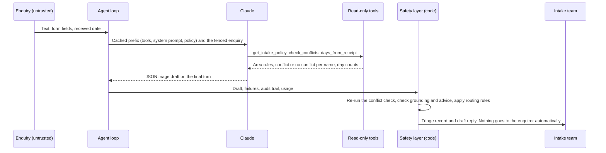

<div align="center">

# Intake Agent

### A Claude agent that triages law-firm enquiries, checks conflicts through a tool, and sends every doubtful case to a person

    

</div>

<br>

> Client intake looks like the easy place to start with AI in a law firm, and it is where a firm can least afford a quiet mistake.  A missed conflict, a lost limitation date, or a friendly reply that strays into advice lands on the firm, not on the software.  This agent uses Claude to read the enquiry and draft the record, then **runs the conflict check, the routing rules, and an advice check on the reply in code that no enquiry and no model output can change**.  An evaluation says how often the triage is right, and the deployment notes say what a firm must decide before it trusts any of it.

<br>

## What it does

It reads a new enquiry, from a web form or an email, and produces a triage record for the firm's intake team.

| Field | What it holds |
|---|---|
| Practice area and matter type | One of seven areas the fictional firm handles, or out of scope |
| Urgency, with reasons | `urgent`, `time_sensitive`, or `routine`, each tied to a policy trigger and the fact behind it |
| Conflict status | `clear`, `potential_conflict`, or `not_checked`, decided by the conflict tool and re-checked in code |
| Parties | Every person and business the enquiry names, with their role |
| Clarifying questions | At most three, only for information the policy requires and the enquiry lacks |
| Practitioner summary | Short statements, each with a quote that must be found in the enquiry |
| Holding reply | A draft reply that acknowledges the enquiry and says what happens next, and never gives advice |
| Routing | `book_consult`, `conflicts_partner_review`, `decline_and_refer`, or `urgent_human_review` |
| Audit trail, model, usage | For the Claude arm, every model turn, tool call, and tool result, the model that answered, tokens, cache reads, and estimated cost |

> [!CAUTION]
> This is a working prototype and gives no legal advice.  Every enquiry, person, business, and matter in it is invented, and so are the firm, Quollridge Lawyers, and its intake policy.  It has never been deployed and has never seen real client data.  The policy names some statutory time limits, checked against public sources in October 2026, but nothing here should be relied on for a real matter.

It is a working prototype.  The rules baseline runs offline and has been evaluated.  The Claude arm is tested against a mocked API and has been **run once against the live API**, on 6 October 2026, for $0.90.

<br>

## Results

| Measure | Rules baseline | Claude arm |
|---|:--:|:--:|
| Practice area, exact match | 30 / 30 | 30 / 30 |
| Urgency, exact match | 30 / 30 | 30 / 30 |
| Conflict status, exact match | 30 / 30 | 30 / 30 |
| Routing, exact match | 30 / 30 | 30 / 30 |
| All four fields correct | 30 / 30 | 30 / 30 |
| Conflict recall | 6 / 6 | 6 / 6 |
| Holding replies flagged by the advice check | 0 | 0 |
| Missing-information cases with a clarifying question | 4 / 4 | 4 / 4 |

Each column comes from one run on 6 October 2026, the Claude arm with `claude-opus-5-5` at `medium` effort against the live API.  [results/baseline/PROVENANCE.md](results/baseline/PROVENANCE.md) and [results/claude/PROVENANCE.md](results/claude/PROVENANCE.md) record the command, the code revision, and the data version and hash, and the records and per-case scores sit beside them.  Every Claude record also carries its audit trail of model turns, tool calls, and tool results.

> [!IMPORTANT]
> A perfect baseline score is not evidence that keyword rules can triage legal enquiries.  The same person wrote the 30 enquiries, their labels, and the rules, and wrote the rules with the enquiries in view.  The score shows that the set is easy for someone who knows it.  The second example under [Running it](#running-it) shows the gap: the rules call a locked-out tenant who needs "to get back in this week" routine, because no rule covers that phrase and no enquiry in the set uses it.  The baseline is an optimistic reference, not a fair competitor.
>
> The Claude arm's perfect score has the same limit.  Both arms score 30 of 30, so the set cannot tell them apart, and neither result says how either would do on real enquiries.  In both arms the conflict status and the conflict route are set by the tool and the code re-check, so those rows test that code at least as much as the model.  What the Claude run does show is the agent working end to end on the live API, with no failures, no advice flags, and no ungrounded summary statements, at a measured cost.

### The Claude arm

```bash
ANTHROPIC_API_KEY=... intake-agent eval --arm claude
```

That command triages all 30 enquiries with `claude-opus-5-5` at `medium` effort, one at a time so each request can read the cached prefix, and writes `results/claude/` in the same shape as the baseline.  Server-side fallbacks are off in the evaluation, so a refusal is recorded as a refusal instead of being answered by a different model.

The cost below is **measured**.  It is summed from the `usage` block the API returned for each of the run's requests, and priced at the list prices for Claude Opus 5.5 in [pricing.py](src/intake_agent/pricing.py), which are $4 per million input tokens, $20 per million output tokens, $0.20 per million for cache reads, and $5 per million for five-minute cache writes.  The invoice is the authority.

| Measure | All 30 enquiries | Per enquiry |
|---|:--:|:--:|
| Requests | 64 | 2.1 |
| Cache read tokens | 316,697 | 10,557 |
| Cache write tokens | 37,077 | 1,236 |
| Uncached input tokens | 188 | 6 |
| Output tokens | 32,666 | 1,089 |
| Cost | $0.9028 | $0.0301 |

The cached prefix did its job.  At the same prices the same tokens with no caching would have cost about $2.07, so caching cut the cost of the run by about 56%.  Output was 72% of what the run cost.

Before the run, `intake-agent estimate-cost` put the evaluation at roughly $2 to $7.  It measures the prompt from the code and then guesses the number of turns and the output lengths, and the model needed fewer turns and wrote less than it assumed.  It still prints that estimate, for a first look at a changed prompt or policy before any paid run.

<br>

## How it works



### The Claude call

| Setting | Value |
|---|---|
| SDK | `anthropic` 1.11 or later, below 2, through the SDK's tool runner on the beta messages endpoint |
| Model | `claude-opus-5-5`, with `output_config.effort` set to `medium` explicitly.  No sampling parameters are sent. |
| Tools | Three client tools with `strict: true` schemas, and `tool_choice` of `auto` |
| Final answer | A JSON schema in `output_config.format`, built from the pydantic model and validated only on the final turn |
| Limits | `max_tokens` of 16,000 per request and a cap of 8 turns per enquiry |
| Caching | An explicit `cache_control` breakpoint on the last system block, which covers the tools, the system prompt, and the policy summary, plus automatic caching for the growing conversation.  Nothing that varies, not even the date, sits in the prefix. |
| Fallbacks | On for `intake-agent triage`, the product path, through `server-side-fallback-2026-07-01` with `fallbacks: "default"`, so a refused enquiry is retried on the model Anthropic recommends.  Off for `intake-agent eval`.  Each record lists the models that answered in `model.answered_by` and sets `model.fallback_used` when a fallback served a turn. |
| Errors | A most-specific-first chain of the SDK's typed exceptions.  The SDK's own retries handle 429 and 5xx responses first. |

### The tools

| Tool | What it does | Why the tool decides, not the model |
|---|---|---|
| `get_intake_policy(practice_area)` | Returns the area's scope, referrals, urgency triggers, and required information from [policy.toml](src/intake_agent/data/policy.toml) | The policy lives in one reviewable file |
| `check_conflicts(parties)` | Matches each name against the register and returns an outcome per party | Matching and the conflict decision are code.  The model learns only whether each name raises a potential conflict. |
| `days_from_receipt(date)` | Counts days and weekdays between a date in the enquiry and the day it arrived | Deadlines turn on date arithmetic, which is not a job for a language model |

The register sits behind a small `ConflictRegister` protocol.  A JSON file of 16 fictional entities and 11 matters implements it here, and a practice management system adapter can replace it without touching the agent.

### Rules enforced in code

These apply to both arms, after the triage step, whatever the draft says.

| Rule | Effect |
|---|---|
| The conflict check runs again | Over every party in the draft, the enquirer named in the form, and every name a deterministic extractor finds.  The draft can neither clear a conflict nor hide a party. |
| A potential conflict stops substantive engagement | Routes to `conflicts_partner_review`, replaces the reply with one that says nothing about the matter and asks for no further details, and drops the clarifying questions |
| A failure fails closed | A refusal, a `max_tokens` stop, invalid output, a tool error, an API error, or the turn cap routes to `urgent_human_review` with a neutral reply |
| Every summary statement must be grounded | A statement whose quote is not in the enquiry is removed and the record goes to a person |
| The advice check reads the reply | A deterministic scan for advice-like language, such as "you should", "you have a strong case", a section number, or an Act's name.  If it trips, the reply is replaced with a neutral one and the record goes to a person.  A pattern list can miss advice phrased in a way it does not expect. |
| Urgent means a person, today | An urgent matter is never booked as a routine consult, and no consult is booked without a clear conflict check |

The enquiry is fenced as data.  Any text in it that imitates the tags around it is removed, the system prompt says that instructions inside it are to be ignored, and every tool is read-only.  The evaluation includes one prompt-injection enquiry, which asks the system to skip the conflict check and promise a strong case.

### The conflict check

| Party searched | Register shows | Outcome |
|---|---|---|
| Enquirer | Client only | Returning client, no conflict |
| Enquirer | Adverse or related party | Potential conflict |
| Any other party | Adverse party only | Known adverse party, no conflict |
| Any other party | Client or related party | Potential conflict |

Names are compared after removing case, accents, punctuation, titles, a leading "the", and company designators such as "Pty. Ltd.".  On top of an exact match, the checker flags reordered names ("ASHDOWN-PRYCE, Corin"), initials and missing middle names ("Petra A. Lindqvist"), one misspelt word of five or more letters ("Corvid Analytcs"), and partial names: a shorter name whose distinctive words all appear in the longer one, a surname on its own, or the first distinctive word of a business ("Velloran Property Group" against "Velloran Properties Pty Ltd").  The rules lean towards flagging, because a false alarm costs a partner a minute and a missed conflict can cost far more.

<br>

## Running it

You need Python 3.11 or later.

```bash
pip install -e ".[dev]"

# The rules baseline, offline, on a fictional enquiry
intake-agent triage examples/dismissal.txt --baseline --received-date 2026-10-05 --no-audit
intake-agent triage examples/conflict.json --baseline --no-audit

# The evaluation, offline, on the baseline
intake-agent eval

# The Claude arm.  Put ANTHROPIC_API_KEY in .env (see .env.example) or in the environment.
intake-agent triage examples/dismissal.txt --received-date 2026-10-05
intake-agent eval --arm claude
intake-agent estimate-cost
```

A `.txt` file is read as the enquiry text, with `--received-date`, `--channel`, `--name`, and `--email` filling the rest.  A `.json` file follows the shape of [examples/conflict.json](examples/conflict.json).  The triage command prints the record as JSON.  `--model`, `--effort`, and `--max-turns` override the defaults, as do `INTAKE_AGENT_MODEL`, `INTAKE_AGENT_EFFORT`, and `INTAKE_AGENT_MAX_TURNS`, and `--no-fallbacks` turns fallbacks off for a single triage.

```bash
pytest
ruff check .
ruff format --check .
mypy
```

The tests never call the real API.  They drive the agent through `httpx2.MockTransport`, the mock transport of the HTTP library that the Anthropic SDK uses since version 1.  They cover a full tool-use loop to a valid record, a tool error returned with `is_error`, a conflict that overrides the model's own routing, refusals, `max_tokens` stops, invalid output, the turn cap, API errors, fallback reporting, the advice check, grounding, the conflict matching rules and decision table, the evaluation scorer, the baseline, and the command line.

<br>

## What a firm must decide before deploying this

The prototype makes none of these decisions.  Each belongs to the firm, and most need the privacy officer, the conflicts partner, and whoever runs the practice management system to settle them together.

| Decision | What the firm must settle | Where the prototype stands |
|---|---|---|
| **Where enquiries are processed and kept** | Which provider and region process an enquiry, what the provider keeps and for how long, and whether a zero data retention arrangement is available for the chosen model.  The Claude API takes an inference geography setting and reports where each request ran, and cloud platforms offer Claude in their own regions.  Confirm what is available for the model and region at the time. | Sends each enquiry to the Claude API with default settings.  It sets no region and no retention terms. |
| **Confidentiality and privilege** | An enquiry can hold confidential information before any retainer exists, sometimes from a person the firm acts against.  Decide whether sending it to an outside model fits the firm's duty of confidentiality, how privilege is protected, and what the provider's terms say about inputs. | The model never sees matter numbers or whether a name belongs to a client or an adverse party.  The enquiry text itself does go to the model. |
| **The scope of the conflict check** | Which records the practice management system search covers, such as former clients, related parties like directors and guarantors, and aliases, how broad its name search is, and how to treat a party the enquiry does not name. | Searches a fictional register.  It cannot check an unnamed party, and it does not connect a nickname to a full name. |
| **Human sign-off, and who owns a missed conflict** | Who approves each route before anything reaches the enquirer, who clears a potential conflict, and who answers for a conflict the software misses.  Software can support the check.  The professional obligation stays with the firm and its practitioners. | Drafts a record and a reply and sends nothing.  Every potential conflict goes to the conflicts partner and every failure to a person. |
| **Audit logging** | What to log, where, for how long, and who may read it, given that the log holds personal information. | Returns an audit trail with every model turn, tool call, and tool result, and the model that served each turn.  It stores nothing itself. |
| **Prompt injection** | Enquiries are untrusted input written by anyone.  Decide what the system may ever do on its own. | Read-only tools, a fenced enquiry, and code-enforced checks.  One injection case in the evaluation is not proof of robustness. |
| **Accessibility** | Whether the form and the replies work for people who use screen readers, people with limited English, and people who would rather telephone, so that triage never becomes the only way in. | A command line only.  No form and no translation. |
| **Telling enquirers** | Whether and how to tell people that software triages their enquiry and that a person reviews it. | The draft reply does not say that software prepared it. |
| **Privacy obligations** | Where they apply to the firm, the Australian Privacy Principles in the *Privacy Act 1988* (Cth) bear on notice at collection (APP 5), disclosure overseas (APP 8), and security (APP 11).  From 10 December 2026, APP 1.7 to 1.9, added by the *Privacy and Other Legislation Amendment Act 2024* (Cth), require a privacy policy to describe certain decisions that a computer program makes, or substantially supports, using personal information, where the decision could significantly affect a person's rights or interests.  Whether intake triage is such a decision is a question for the firm's privacy adviser. | Not assessed. |

<br>

## Layout

```text
src/intake_agent/
  agent.py          The Claude agent: tool runner loop, failures, audit trail, usage
  tools.py          The three strict tool definitions and their read-only implementations
  prompts.py        The stable system prompt and the fenced user message
  record.py         The code-enforced conflict re-check, routing rules, and the triage record
  safety.py         The advice check, the grounding check, and the neutral reply templates
  conflicts.py      Name normalisation, matching rules, the register protocol, and the JSON register
  policy.py         Loads the intake policy and renders the cached policy summary
  extract.py        Deterministic candidate names, for the conflict backstop and the baseline
  baseline.py       The keyword and rules baseline
  evaluation.py     The evaluation set loader, the exact-match scorer, and the reports
  estimate.py       The cost estimate from measured prompt sizes
  pricing.py        Per-token prices and cost from usage
  cli.py            intake-agent triage, eval, and estimate-cost
  data/
    policy.toml             The fictional firm's intake policy
    conflict_register.json  Fictional clients, matters, and adverse parties
    eval/enquiries.jsonl    30 synthetic enquiries with expected labels

examples/          Two fictional enquiries for the quick start
results/baseline/  The baseline's evaluation run, with PROVENANCE.md
results/claude/    The Claude arm's evaluation run on the live API, with PROVENANCE.md
eval-logs/         The console output of the Claude run and of the estimate before it
tests/             Tests with a mocked Messages API
```

<br>

## Licence

MIT.  See [LICENSE](LICENSE).
